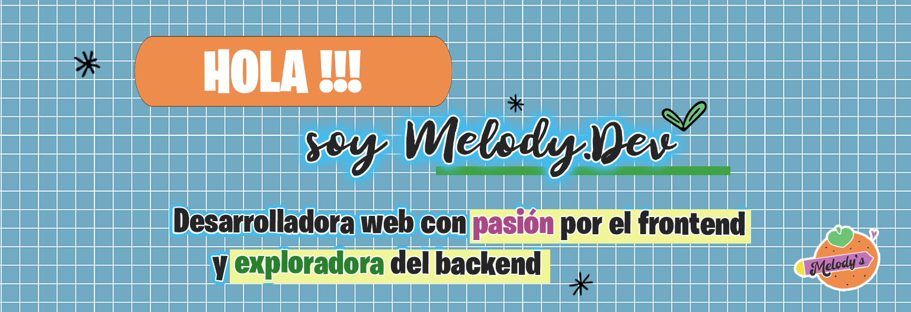

<h1 align="center">Hola 👋, Soy Lisette Jofré</h1>
<h3 align="center">Pero puedes llamarme MelodyDev 🍊</h3>

👩‍💻 Apasionada por la programación y la creatividad. Me encanta aprender creando proyectos prácticos 

 
 

  
  
  
🧡 Actualmente me encuentro trabajando en la construcción de mi portafolio.

  
🍊 Estoy trabajando con React y Tailwind aunque me encanta trabajar con CSS Puro.

  
🍁 Busco colaborar en cualquier proyecto que se alinee con mis intereses y experiencia.

  
📙 Estoy en constante aprendizaje para mejorar mis habilidades día a día.

  
🐾 Me encantan los gatitos, los perritos y los videojuegos como Animal Crossing o Stardew Valley.

 

<h3 align="center">MIS HABILIDADES ✨</h3>

<h3 align="center"> Desarrolladora Frontend </h3> 

  

<h3 align="center"> Desarrolladora Backend </h3> 

  

<h3 align="center"> Herramientas </h3> 

  

<h3 align="center"> Explorando</h3> 

  

<h3 align="center"> Conéctate conmigo 😊</h3> 

    
    

